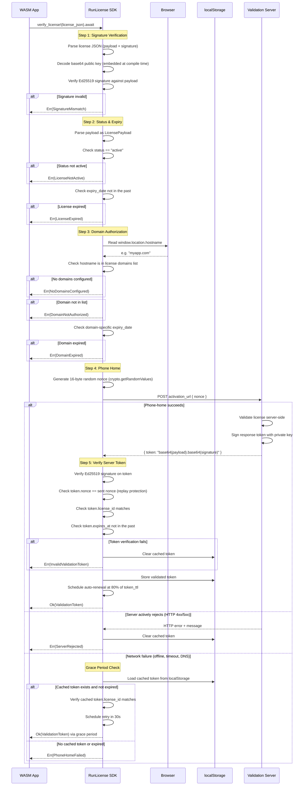

# RunLicense SDK for WebAssembly (Rust)

[](https://github.com/runlicense/sdk-webassembly-rust/actions/workflows/ci.yml)
[](LICENSE)

Rust SDK for verifying [RunLicense](https://runlicense.com) Ed25519-signed licenses in WebAssembly applications.

The SDK handles the entire license lifecycle — signature verification, domain authorization, server validation, token caching, and automatic renewal — so the consuming app only needs a single call.

## How it works

The SDK embeds your RunLicense public key at **compile time** (from `keys/runlicense.key`). All cryptographic verification happens client-side in the WASM module — no secrets are exposed to the browser.

### License payload

A license JSON string contains a `payload` and an Ed25519 `signature`. The payload includes:

| Field | Description |
|---|---|
| `license_id` | Unique license identifier |
| `product_id` | Product this license is for |
| `customer_id` | Customer who owns the license |
| `status` | Must be `"active"` to pass verification |
| `expiry_date` | Optional ISO 8601 expiry for the whole license |
| `domains` | List of authorized hostnames with optional per-domain expiry |
| `activation_url` | Server endpoint for phone-home validation |
| `token_ttl` | How often (seconds) the SDK should re-validate (default: 3600) |
| `allowed_features` | Optional feature flags (passed through to the app) |
| `usage_limit` | Optional usage cap (passed through to the app) |

### What happens when you call `verify_license!`

`verify_license!(license_json).await` runs the full verification pipeline:

1. **Signature verification** — parse the license JSON, decode the embedded public key, verify the Ed25519 signature against the payload
2. **Status & expiry** — check that `status == "active"` and `expiry_date` (if set) is in the future
3. **Domain authorization** — auto-detect the hostname from `window.location.hostname`, check it's in the license's `domains` list, and verify the domain-level expiry
4. **Phone-home** — generate a cryptographic nonce, POST it to the `activation_url`, receive a signed token back from the server
5. **Token verification** — verify the server token's Ed25519 signature, check the nonce matches (replay protection), verify the `license_id` matches, check `expires_at`
6. **Caching** — store the validated token in `localStorage` for offline grace periods
7. **Auto-renewal** — schedule a background re-validation at 80% of the `token_ttl`

## Setup

### 1. Add the dependency

```toml
[dependencies]
runlicense-sdk-webassembly-rust = { git = "https://github.com/runlicense/sdk-webassembly-rust", features = ["wasm"] }
```

### 2. Add your public key

Create `keys/runlicense.key` in your project root containing your RunLicense public key (base64-encoded Ed25519, single line):

```
your-base64-encoded-public-key-here
```

This file is embedded at compile time via `include_str!` — it is not shipped separately or read at runtime.

### 3. Add your license JSON

Your application needs a license JSON string, which is provided by the RunLicense API. It looks like this:

```json
{
  "payload": "{\"license_id\":\"lic_abc123\",\"product_id\":\"prod_1\",\"customer_id\":\"cust_1\",\"status\":\"active\",\"expiry_date\":null,\"domains\":[{\"domain\":\"myapp.com\",\"expiry_date\":null}],\"activation_url\":\"https://runlicense.com/api/v1/licenses/lic_abc123/validate\",\"token_ttl\":3600,\"allowed_features\":null,\"usage_limit\":null}",
  "signature": "base64-encoded-ed25519-signature"
}
```

How you deliver this to your WASM app is up to you — embed it in your build, fetch it from your backend, or load it from a config endpoint.

### 4. Verify on startup

Call `verify_license!` early in your app's startup, before rendering or initializing your main logic:

```rust
match runlicense_sdk_webassembly_rust::verify_license!(&license_json).await {
    Ok(token) => {
        // License valid — token contains license_id, domain, expiry info
        // Auto-renewal is already scheduled in the background
        start_app();
    }
    Err(e) => {
        // License invalid — show error, do not start the app
        show_error(&format!("License invalid: {e}"));
    }
}
```

## Verification flow



## Auto-renewal

After a successful verification, the SDK schedules a background phone-home at **80% of the `token_ttl`** (e.g., 48 minutes into a 60-minute TTL). This runs silently via `setTimeout` + `spawn_local`:

- **Renewal succeeds** — new token cached, next renewal scheduled
- **Network failure** — retry in 30 seconds, current session continues
- **Server rejects** — cached token cleared, current session continues but **next page load will fail**
- **Token tampered** — cached token cleared, same as above

The app is never interrupted mid-session. Revocation takes effect on the next activation.

## Offline resilience

| Scenario | Outcome |
|---|---|
| Phone-home succeeds | Token cached, verification passes |
| Phone-home fails (network) + valid cached token | Grace period, verification passes |
| Phone-home fails (network) + expired/no cached token | Verification fails |
| Server actively rejects (revoked license) | Cached token cleared, verification fails |
| Token tampered (bad signature/nonce) | Cached token cleared, verification fails |
| First load ever while offline | Verification fails (no cached token yet) |

The server controls the grace period length via the `expires_at` field on the validation token. A longer `expires_at` means more offline tolerance; a shorter one means tighter enforcement.

## WIT interface generation

When distributing WASM modules through a marketplace or execution environment, the host needs to know how to interact with your module — what functions it exports, what parameters they take, and what they return. A raw `.wasm` binary only contains low-level type information (`i32`, `f64`), not the rich types your Rust code actually uses.

The SDK solves this with a **WIT (WebAssembly Interface Types) generator** that produces a `.wit` file describing your module's public interface. WIT is the standard interface definition language for the [WebAssembly Component Model](https://component-model.bytecodealliance.org/).

### Why a WIT file is needed

A compiled WASM binary exports functions like:

```
(func $calculate_total (param i32 i32 f64) (result i32))
```

An execution environment can see that this function exists, but it has no idea what those parameters mean. The WIT file bridges that gap:

```wit
package mycompany:pricing;

interface api {
  /// Calculate the total price for a list of items after applying a discount.
  calculate-total: func(prices-json: string, quantity: u32, discount-percent: f64) -> string;
}

world module {
  export api;
}
```

With this file, a marketplace platform can:

- **Generate a preview UI** with correctly labeled input fields and types
- **Validate capability requirements** before running the module
- **Catalog and search** modules by their exported interface
- **Sandbox execution** by only providing the imports the module declares it needs

### How it works

The generator combines two sources of information:

1. **WASM binary introspection** — parses the compiled `.wasm` to discover which functions are actually exported (the authoritative list)
2. **Rust source parsing** — scans your `.rs` files for `#[wasm_bindgen]` annotated functions, extracting doc comments, parameter names, and rich Rust types which are mapped to WIT types

The Rust-to-WIT type mapping:

| Rust type | WIT type |
|---|---|
| `String`, `&str` | `string` |
| `bool` | `bool` |
| `u8`, `u16`, `u32`, `u64` | `u8`, `u16`, `u32`, `u64` |
| `i8`, `i16`, `i32`, `i64` | `s8`, `s16`, `s32`, `s64` |
| `f32`, `f64` | `f32`, `f64` |
| `Vec<T>` | `list<T>` |
| `Option<T>` | `option<T>` |
| `Result<T, E>` | `result<T, E>` |

### Generating a WIT file

WIT generation is built into `generate_manifest`. Pass `--src` to enable it (requires the `tools` feature):

```sh
cargo run --features tools --bin generate_manifest -- pkg/app_bg.wasm --src src --package mycompany:my-module
```

This produces both `wasm_manifest.json` (integrity hash) and `module.wit` (interface description) in a single step.

Options:

| Flag | Description | Default |
|---|---|---|
| `<wasm_path>` | Path to compiled `.wasm` binary (required) | — |
| `--src <dir>` | Rust source directory to scan (enables WIT generation) | — |
| `--package <name>` | WIT package name | `local:module` |
| `--world <name>` | WIT world name | `module` |
| `--interface <name>` | WIT interface name | `api` |
| `--wit-output <path>` | Output `.wit` file path | alongside wasm as `module.wit` |

### Using the macro in your project

Add the `tools` feature to your dependency:

```toml
[dependencies]
runlicense-sdk-webassembly-rust = { git = "https://github.com/runlicense/sdk-webassembly-rust", features = ["wasm", "tools"] }
```

Create `src/bin/generate_manifest.rs`:

```rust
runlicense_sdk_webassembly_rust::generate_manifest_main!();
```

Then run it as part of your build process:

```sh
# Build WASM first
wasm-pack build --target web

# Generate integrity manifest + WIT interface file
cargo run --features tools --bin generate_manifest -- pkg/app_bg.wasm --src src --package mycompany:my-module
```

Without the `tools` feature or without `--src`, it behaves exactly as before — only generating the integrity manifest.

The resulting `.wit` file ships alongside your `.wasm` binary when submitting to a marketplace.

## WASM integrity check

The SDK can also verify that the WASM binary hasn't been tampered with:

```rust
// Generate a manifest after building WASM:
// cargo run --bin generate_manifest -- pkg/app_bg.wasm

// At runtime, fetch the .wasm and manifest, then verify:
runlicense_sdk_webassembly_rust::verify_wasm_integrity(&wasm_bytes, &manifest_json)?;
```

This computes the SHA-256 hash of the WASM binary and compares it against the hash in `wasm_manifest.json`.

## Error types

```rust
pub enum LicenseVerificationError {
    InvalidJson,                      // License JSON couldn't be parsed
    InvalidPublicKey,                 // Embedded public key is malformed
    InvalidSignature,                 // Signature encoding is invalid
    SignatureMismatch,                // Signature doesn't match payload
    NoDomainsConfigured,              // License has empty domains list
    DomainNotAuthorized,              // Current hostname not in domains
    DomainExpired,                    // Domain-specific expiry has passed
    LicenseExpired,                   // License expiry_date has passed
    LicenseNotActive,                 // Status is not "active"
    NoActivationUrl,                  // Payload missing activation_url
    PhoneHomeFailed(String),          // Network/transport error
    InvalidValidationToken,           // Server token signature invalid
    ValidationTokenNonceMismatch,     // Nonce doesn't match (replay attack)
    ValidationTokenExpired,           // Server token has expired
    ValidationTokenLicenseMismatch,   // Token license_id doesn't match
    ServerRejected(String),           // Server returned HTTP error
}
```

## CLI tools

The SDK also provides macros for generating CLI binaries, useful for validating licenses or generating WASM integrity manifests during your build process.

### Validate a license

Create `src/bin/validate_license.rs`:

```rust
runlicense_sdk_webassembly_rust::validate_license_main!();
```

```sh
cargo run --bin validate_license -- '{"payload":"...","signature":"..."}'
```

### Generate a WASM integrity manifest

Create `src/bin/generate_manifest.rs`:

```rust
runlicense_sdk_webassembly_rust::generate_manifest_main!();
```

```sh
# Integrity manifest only
cargo run --bin generate_manifest -- pkg/app_bg.wasm

# Integrity manifest + WIT interface file (requires tools feature)
cargo run --features tools --bin generate_manifest -- pkg/app_bg.wasm --src src --package mycompany:my-module
```

## Features

| Feature | Description |
|---|---|
| `wasm` | Enables the full WASM verification pipeline: browser console logging, `window.location` hostname detection, Fetch API for phone-home, `localStorage` for token caching, auto-renewal via `setTimeout`. Pulls in `web-sys`, `wasm-bindgen`, `wasm-bindgen-futures`, `js-sys`. **Required for WASM projects.** |
| `tools` | Enables the WIT generation toolchain: WASM binary introspection, Rust source parsing, and `.wit` file generation. Pulls in `wasmparser`, `syn`, `walkdir`, `quote`. **Required for `generate_wit` binary.** |

## API reference

### Macros

| Macro | Description |
|---|---|
| `verify_license!(json)` | Full async license verification — returns `Result<ValidationToken, LicenseVerificationError>` |
| `validate_license_main!()` | Generate a CLI `main()` for license validation |
| `generate_manifest_main!()` | Generate a CLI `main()` for WASM manifest + optional WIT generation |

### Functions

| Function | Description |
|---|---|
| `verify_wasm_integrity(wasm_bytes, manifest_json)` | Verify WASM binary against a SHA-256 manifest |
| `compute_wasm_sha256(wasm_bytes)` | Compute SHA-256 hash of WASM bytes |
| `wit_gen::generate_wit(wasm_bytes, src_dir, config)` | Generate WIT from WASM binary + Rust source (requires `tools` feature) |
| `wit_gen::generate_wit_from_source(src_dir, config)` | Generate WIT from Rust source only (requires `tools` feature) |
| `wit_gen::extract_wasm_exports(wasm_bytes)` | Extract exported function names from a WASM binary (requires `tools` feature) |
| `wit_gen::parse_rust_sources(src_dir)` | Parse Rust source files for `#[wasm_bindgen]` function metadata (requires `tools` feature) |
